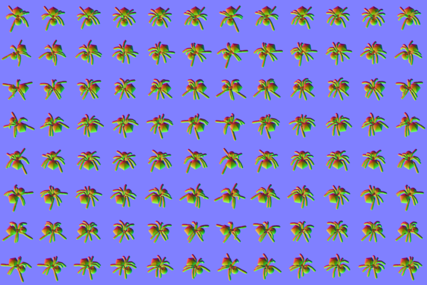

# blender_spritesheet_builder
headless Blender spritesheet builder utility for normal maps and renders for gamedev

##### Requires the PIL library, installed into Blender's bundled Python 

Command line syntax:

##### blender -b -P sheetbuild.py -- `[ANG] [CAP] [RADIUS] [MODEL.BLEND]`

ANG : number of angles of the model to produce in the spritesheet

CAP : number of frames in the animation

RADIUS : radius of the model in the blend file

MODEL.BLEND : name of the blend file where the name MODEL is the same as the name of the mesh of the desired object to be captured

(resized) examples:

