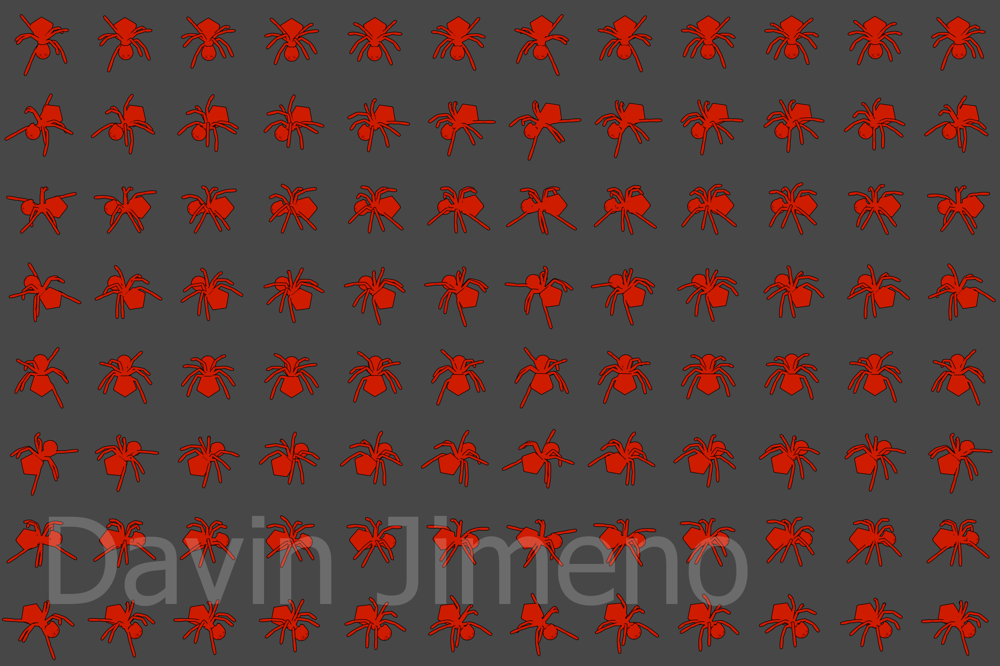

# blender_spritesheet_builder
headless Blender spritesheet builder utility for normal maps and renders

##### Requires the PIL library, installed to Blender's bundled Python 

Command line syntax:

##### blender -b -P sheetbuild.py -- `[ANG] [CAP] [RADIUS] [MESH.BLEND]`

ANG : number of angles of the model to capture in the spritesheet

CAP : number of frames to capture in the spritesheet

RADIUS : radius of the mesh in the blend file

MESH.BLEND : name of the blend file where MESH is the name of the mesh of the object to capture, e.g "Spider.blend" for a mesh named "Spider"

creates an output folder that contains a folder for all the normal maps + the combined normal map spritesheet
and a folder for all the renders + the render spritesheet

### (resized) examples:
#### normal spritesheet

#### render spritesheet

